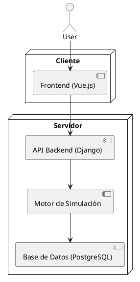

# 🧑‍🍳 Simulación de Gnomos Cocineros 🧙‍♂️

Bienvenidos a **Simulación de Gnomos Cocineros**, una simulación matemática que combina probabilidad y gestión en un entorno fantasioso. Este proyecto busca simular las habilidades únicas de cinco gnomos cocineros que deben cumplir una misión: preparar un banquete para la gran fiesta del pueblo. Enfréntate a desafíos como la gestión del tiempo, la obtención de ingredientes raros y el control de eventos aleatorios que pueden alterar el resultado final.

## 🎯 Objetivo del Proyecto

El objetivo es crear una **simulación automática** que modele el comportamiento de cinco gnomos cocineros: el panadero, el chef de sopas, el pastelero, el carnicero y el aprendiz. Cada gnomo tiene habilidades específicas y sus acciones estarán regidas por **algoritmos probabilísticos avanzados** y **eventos aleatorios**. Al finalizar la simulación, se mostrará un **reporte detallado** con los resultados del banquete y el rendimiento de cada gnomo.

## 🚀 Estado Actual

El proyecto está en una fase inicial y aún no se ha implementado ninguna funcionalidad. La planificación está avanzada y contamos con una visión clara de la arquitectura y los objetivos de cada parte del sistema.

## 🛠️ Funcionalidades Clave

### 🔧 Funcionalidades Principales
- **Simulación automática**: Una vez iniciada, la simulación se ejecuta automáticamente sin intervención del usuario.
- **Cinco gnomos con roles específicos**: Panadero, chef de sopas, pastelero, carnicero y aprendiz, cada uno con habilidades y comportamientos únicos.
- **Probabilidad y gestión de tiempo**: La lógica de la simulación se basa en probabilidades y eventos aleatorios, donde cada tarea tiene un porcentaje de éxito basado en las habilidades del gnomo.
- **Eventos externos**: Se introducen eventos aleatorios como la obtención de ingredientes raros o imprevistos que dificultan la cocción.
- **IA adaptativa**: Cada gnomo sigue patrones de comportamiento inspirados en IA clásica (como los fantasmas de Pacman), adaptándose a los eventos del juego.
- **Reporte final**: Al finalizar la simulación, se genera un reporte con el desempeño de cada gnomo y el resultado del banquete.

### 🌐 Plataforma y Tecnología
- **Frontend**: Construido con **Vue.js**, ofrecerá una interfaz simple para iniciar simulaciones y visualizar los resultados. El tablero de visualización incluirá sprites de los gnomos estilo **pixel art**.
- **Backend**: El motor de simulación será manejado por **Python con Django**, lo que permitirá cálculos complejos y algoritmos probabilísticos.
- **Tiempo Real**: El frontend permitirá una visualización en tiempo real del progreso de la simulación y los eventos que ocurren.
- **Base de datos**: **PostgreSQL** será la base de datos encargada de almacenar los resultados de cada simulación, así como el desempeño de los gnomos.

## 🔮 Futuras Funcionalidades

### 🕹️ Modos y Opciones
- **Simulaciones avanzadas**: Se planea añadir más eventos externos y complejidades a la lógica de los gnomos, para hacer el juego más impredecible.
- **Editor de simulaciones**: En el futuro, se permitirá a los usuarios crear sus propios gnomos con habilidades personalizadas y ajustar las probabilidades de éxito.

### 🎨 Visualización y Animaciones
- **Tablero animado**: Implementaremos un tablero en el frontend que mostrará el progreso de la simulación, incluyendo animaciones de los gnomos cocinando y buscando ingredientes.
- **Sprites estilo pixel art**: Se añadirán gráficos estilo retro para darle un toque divertido y nostálgico a la visualización.

### 🧠 Algoritmos de Probabilidad e IA
- **Comportamiento avanzado de gnomos**: Cada gnomo tendrá un algoritmo único que regirá su comportamiento en base a su rol y habilidades, inspirados en IA como los patrones de movimiento de los fantasmas de Pacman.
- **Eventos externos complejos**: Introduciremos un sistema de eventos aleatorios que incluirá factores externos como el clima, disponibilidad de ingredientes o invitados adicionales al banquete.
  
### ⚙️ Rendimiento y Escalabilidad
- **Escalabilidad en la nube**: Se planea optimizar la simulación para permitir múltiples ejecuciones simultáneas en entornos de servidores como AWS o Heroku.
- **Procesamiento paralelo**: En simulaciones más complejas, el motor podrá hacer uso de procesamiento paralelo para reducir tiempos de cálculo.

## 🛠️ Arquitectura del Sistema

La aplicación sigue una arquitectura de tres capas: **frontend**, **backend** y **base de datos**, con Django como el framework del backend.

### Descripción de Componentes

#### Frontend (Vue.js)
- **Funcionalidad**: Proveer una interfaz simple para iniciar la simulación y ver el progreso y resultados.
- **Visualización**: Tablero con sprites de gnomos en **pixel art**, mostrando en tiempo real las tareas que cada gnomo está realizando.

#### Backend (Django)
- **API**: Exponer endpoints REST para iniciar la simulación, consultar resultados y obtener reportes.
- **Motor de Simulación**: Ejecución de la lógica probabilística para la simulación.
- **Persistencia**: Guardar los resultados en la base de datos y generar reportes.

#### Motor de Simulación
- **Lógica de simulación**: Implementada en Python, basada en modelos probabilísticos y eventos aleatorios.
- **IA de Gnomos**: Cada gnomo sigue un algoritmo de comportamiento personalizado.

#### Base de Datos (PostgreSQL)
- **Estructura**:
  - **Tabla Gnomos**: Información sobre cada gnomo (nombre, rol, habilidades).
  - **Tabla Simulaciones**: Registro de cada simulación.
  - **Tabla Resultados**: Resultados individuales de cada gnomo en cada simulación.

## 🎯 ¿Cómo Contribuir?

1. **Clona el repositorio** y crea una rama para tu contribución.
2. Revisa las **issues** abiertas o sugiere mejoras.
3. Implementa nuevas funcionalidades o resuelve bugs.
4. Envía un **pull request** para revisión.

## 🌟 Roadmap del Proyecto

1. **Implementar la lógica básica de simulación**.
2. **Desarrollar el frontend con visualización en tiempo real**.
3. **Añadir eventos aleatorios y algoritmos complejos de IA**.
4. **Optimización para múltiples simulaciones simultáneas en la nube**.
5. **Lanzamiento de una versión beta para pruebas comunitarias**.

---

¡Gracias por interesarte en este proyecto! 🚀 Si te gusta la simulación y la gestión de probabilidades, ¡este es el proyecto para ti! 😎

---
